# 动画重定向技术分析和 Unity 中的应用


<div class="record-meta-block">
<div class="meta-item meta-item--tags"><span class="meta-label">标签</span><span class="meta-value"><a href="/records/?tags=unity" class="meta-tag">Unity 引擎</a> <a href="/records/?tags=animation" class="meta-tag">动画</a> <a href="/records/?tags=animation-retarget" class="meta-tag">动画重定向</a> <a href="/records/?tags=knowledge" class="meta-tag">知识</a> <a href="/records/?tags=ik" class="meta-tag">逆向运动学</a></span></div>
<div class="meta-item"><span class="meta-label">来源</span><span class="meta-value"><a href="https://zhuanlan.zhihu.com/p/25064011" target="_blank" rel="noopener">知乎 - Funny David（董夕的游戏开发笔记）</a></span></div>
<div class="meta-item"><span class="meta-label">收录日期</span><span class="meta-value">2026-02-11</span></div>
<div class="meta-item"><span class="meta-label">来源日期</span><span class="meta-value">2017-02-02（编辑于 2019-07-13）</span></div>
<div class="meta-item"><span class="meta-label">更新日期</span><span class="meta-value">2026-02-11</span></div>
<div class="meta-item"><span class="meta-label">状态</span><span class="meta-value meta-value--status meta-value--info"> 有效</span></div>
<div class="meta-item"><span class="meta-label">可信度</span><span class="meta-value"><span class="star-rating"></span> <span class="star-desc">社区实践验证，Havok 引擎源码经验，270+ 赞同</span></span></div>
<div class="meta-item"><span class="meta-label">适用版本</span><span class="meta-value">Unity 通用（Humanoid 动画系统）</span></div>
</div>


### 概要

系统分析了 Animation Retargeting（动画重定向）技术的基本原理、骨骼映射方案以及在 Unity 引擎中的实际应用经验，包括遇到的问题和解决方法。作者有 Havok 引擎源码阅读和自研引擎实现经验。

### 内容

#### 1. 什么是动画重定向

Animation Retargeting 是一种动画复用技术——将动画数据从一个骨架"拷贝"到另一个骨架的过程：

> Retargeting is just the process of "copying" the animation from one skeleton to the other.

这个"拷贝"并非简单复制，实现方式会影响到动画应用到另一个骨架后的效果。

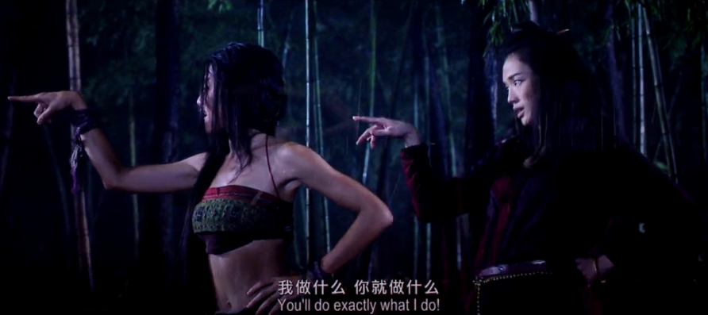

#### 2. 为什么使用动画重定向

**应用场景**：
- 动作捕捉：真实人物动作→虚拟角色
- 建模工具（Max/Maya）中的动作复用
- 游戏开发中不同体型角色共享受击动画等

**不使用重定向的问题**：
-  美术工作量巨大：m 个技能 × n 个角色 = m×n 个动画文件
-  动画维护困难：每处修改需手动同步所有文件
-  打包文件过大：尤其手游包体大小敏感

**使用重定向的收益**：
-  动画数量从 m×n 降低到 m
-  减少美术工作量
-  提升对策划需求变更的灵活度

#### 3. 基本原理（基于参考姿势）

动画重定向主要针对**骨骼动画**，核心是处理骨骼信息（Position、Rotation、Scale）。

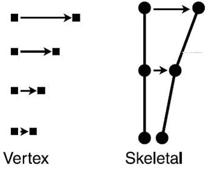

**问题**：直接将 A 骨架的动画数据应用到不同体型的 B 骨架上会出现拉伸等问题。

**解决方案**：基于参考姿势（Reference Pose，通常为 T-Pose）的差异计算：

```
设 a1 = A 的参考姿势, b1 = B 的参考姿势, a2 = 动画某帧姿势
目标: 求 b2 (B 骨架该帧姿势)

原理: a2 - a1 = b2 - b1
计算: b2 = a2 + (b1 - a1)
```

- **Setup 阶段**：预计算 `diff = b1 - a1`（可离线完成）
- **Runtime 阶段**：`b2 = a2 + diff`

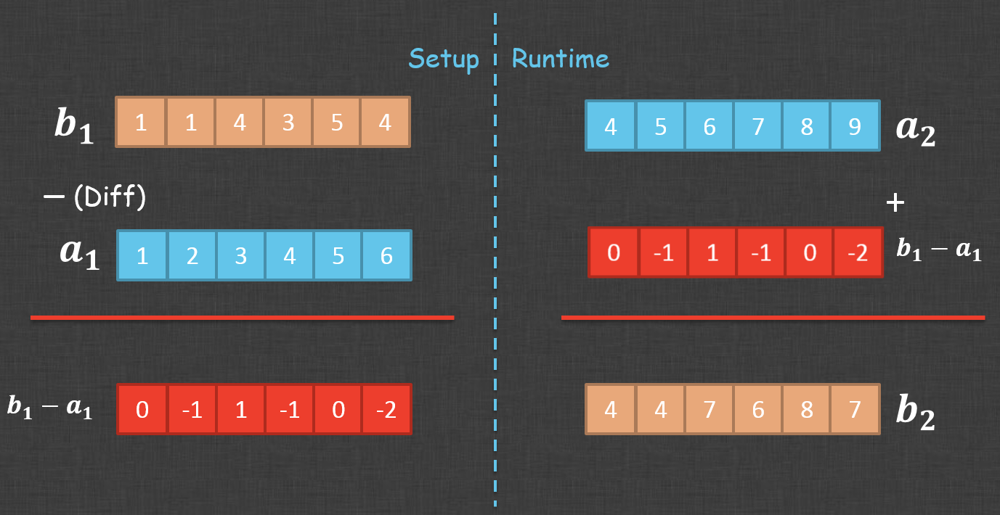

**Havok 引擎细节**：会根据参考姿势中骨骼长度比例（如 A 的 Head 骨骼长 1.0，B 的为 1.5），将比例应用到 scale 部分（scale × 1.5），保证映射后骨骼位置合理。

**优势**：
- 大部分情况下有良好动画效果
- 保留目标骨架的基本姿势特征（如驼背、八字脚等）

#### 4. 骨骼映射

##### 4.1 骨骼名称不一致

- CS 骨骼：去除前缀进行模糊匹配（如 Biped Head vs Bip001 Head）
- Unity：推测根据骨架父子关系和结构计算映射
- Bone 骨骼：在无规范情况下需提供可视化编辑功能让美术手动定义映射

##### 4.2 骨骼数量不一致

**情况一：非关键部位多余骨骼**
- 动画骨架多余：忽略多余骨骼
- 目标骨架多余：保持在参考姿势的 local space 中，跟随父骨骼移动（如飘带会"僵硬"跟随）

**情况二：关键位置骨骼不一致（如脊柱 2~5 根不等）**

简单一对一映射效果差（如头向前倾但背部挺直，脖子拉伸）。

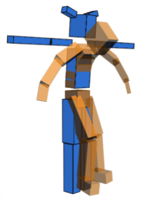

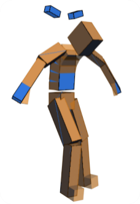

**链式映射（Chain Mapping）**：将多根骨骼组成的骨链 A 映射到骨链 B。
- 对齐起始链骨骼
- 保持骨链原有形态，尽量对齐结束骨骼

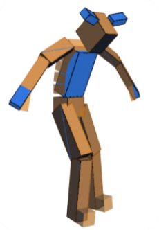

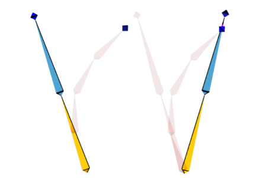

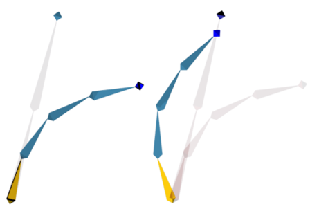

计算方式：用向量点积/叉积 + 半角/二倍角正弦公式得到旋转四元数，避免三角函数计算。


##### 4.3 骨骼父子关系不一致

- 简单不一致可容忍
- 人形→四足/八足等差异过大的情况极难处理
- **基本原则**：骨架相似性越高，重定向效果越好

#### 5. Unity 引擎中的应用

##### 5.1 基本使用方法

Unity 的重定向封装在 **Humanoid 动画系统**中，只支持人形骨架。

Unity 内部定义了一套骨架模板，所有 Avatar 骨骼都必须映射到这套模板上，由同一个 Animator 驱动产生 Retargeting 效果。

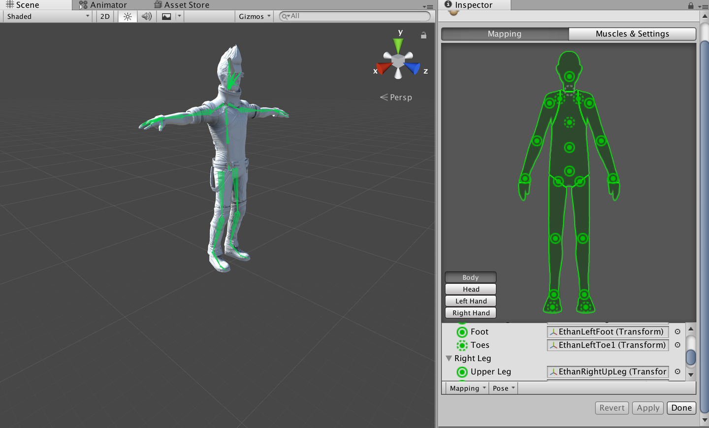

**设置步骤**：
1. 导入 male 模型，设置动画类型为 Humanoid，配置 Avatar 骨骼映射
2. 导入 male 动画，设置类型为 Humanoid，Avatar 设为 male 的 avatar
3. 用 male 动画制作 Animator
4. 导入 female 模型，设置 Humanoid，配置骨骼映射
5. 将 female 模型的 Animator 设为 male 的 Animator → 即可看到重定向效果

##### 5.2 遇到的问题记录

**a) 武器/飘带不移动或偏差大**
- 原因：动画文件 Mask → Transform 中存在未勾选的骨骼
- 解决：把 Transform 下所有骨骼都勾选上

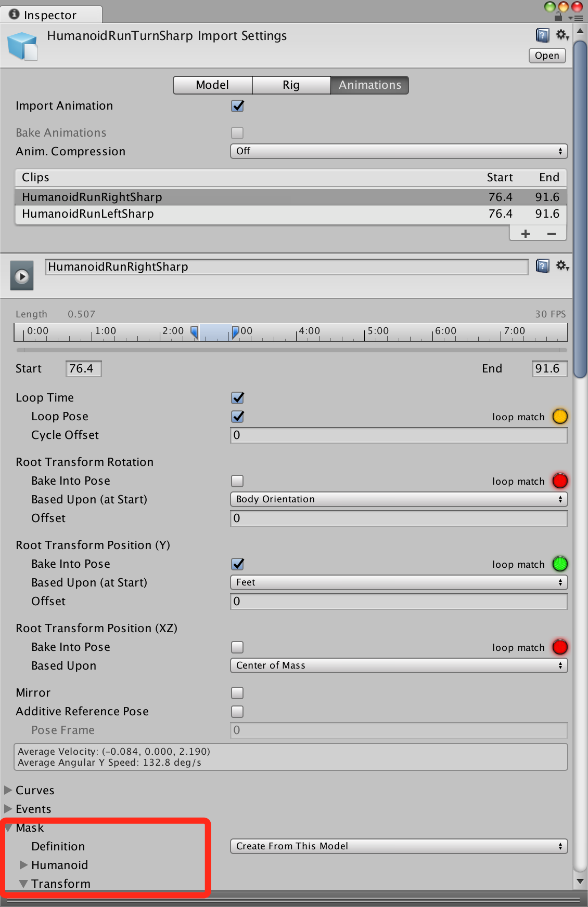

**b) 武器乱飘、与手部无法紧密绑定**
- 原因：武器父骨骼设为盆骨（相对稳定），重定向后体型差异导致偏差
- 解决：将武器骨骼的父骨骼设为手部骨骼

**c) 重定向后脚不贴地**
- 原因：目标角色脚部骨骼在参考姿势中没有贴地
- 解决：在 Avatar Configuration 界面中微调 T-Pose 姿势
- 注意：Unity 定义了 T-Pose 姿势范围，超出会红色提示

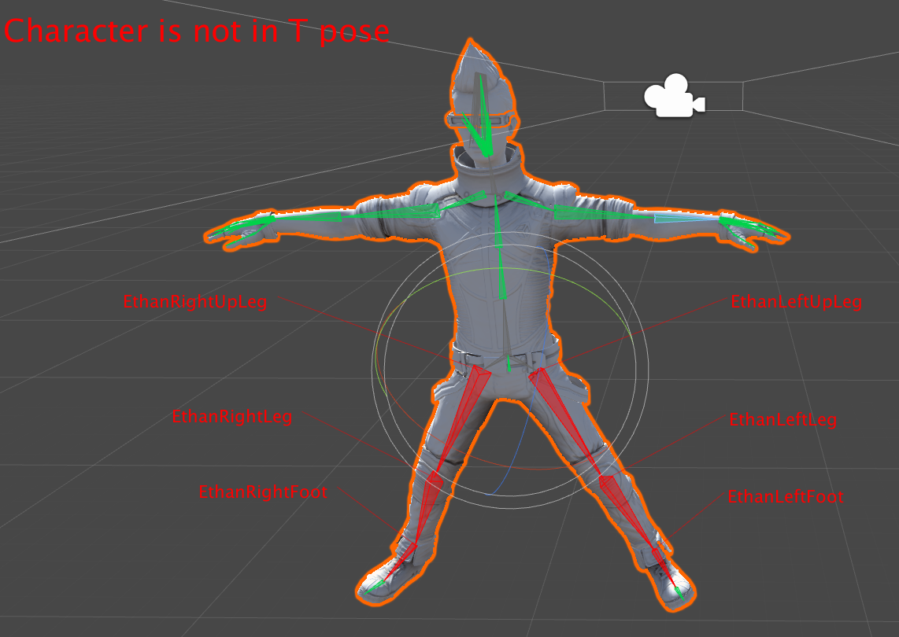

##### 5.3 性能消耗

- Humanoid 相比 Generic 有额外性能消耗，但 Unity 内部做了较好优化，差别不大
- 与蒙皮、渲染指令提交等 CPU 瓶颈相比，重定向消耗不算大
- 通常不会在后期性能 Profile 中被要求优化

#### 6. 扩展阅读

- 学术界有更多深入研究，但多数算法不适用于实时游戏开发
- 推荐论文：[《Real-time Motion Retargeting to Highly Varied User-Created Morphologies》](http://slim.chrishecker.com/images/c/cb/Sporeanim-siggraph08.pdf)——《孢子》游戏的实时动画系统，结合 IK 实现自定制角色动画

#### 7. 结语

动画重定向系统外部看似深奥，深入原理却很简单。但要封装成易用的引擎模块，需要解决大量实际问题和开发编辑工具——由难入易，再由易到难。

### 图片资源清单

所有图片已从知乎原文下载保存至 `../assets/animation-retarget-technology-unity/`：

| # | 文件名 | 说明 | 大小 |
|---|--------|------|------|
| 1 | `01-retarget-concept.png` | 动画重定向概念图（"听话符"比喻） | 333 KB |
| 2 | `02-skeletal-animation.png` | 骨骼动画示意图（骨骼与蒙皮关系） | 31 KB |
| 3 | `03-reference-pose-calc.png` | 参考姿势计算示意图（Setup + Runtime） | 280 KB |
| 4 | `04-bone-chain-mismatch.png` | 骨骼链不一致对比图（蓝色/黄色小人） | 32 KB |
| 5 | `05-simple-mapping-error.png` | 简单映射错误效果（头前倾/脖子拉伸） | 31 KB |
| 6 | `06-chain-mapping-correct.png` | 链式映射正确效果 | 34 KB |
| 7 | `07-chain-2to4-mapping.png` | 2→4 骨骼链映射示意 | 25 KB |
| 8 | `08-chain-4to2-mapping.png` | 4→2 骨骼链映射示意 | 24 KB |
| 9 | `09-vector-quaternion-calc.png` | 四元数向量计算优化 | 124 KB |
| 10 | `10-unity-avatar-mapping.png` | Unity Avatar 骨骼映射界面 | 389 KB |
| 11 | `11-unity-mask-transform.png` | Unity Mask Transform 设置 | 199 KB |
| 12 | `12-unity-tpose-adjust.png` | Unity T-Pose 微调界面 | 286 KB |

### 参考链接

- [知乎原文 - Funny David](https://zhuanlan.zhihu.com/p/25064011) - 原始出处（270+ 赞同）
- [CSDN 转载](https://blog.csdn.net/rexgp/article/details/126387954) - 转载版
- [Unity 官方 Retargeting 文档](https://docs.unity3d.com/Manual/Retargeting.html)
- [《Real-time Motion Retargeting to Highly Varied User-Created Morphologies》](http://slim.chrishecker.com/images/c/cb/Sporeanim-siggraph08.pdf) - 《孢子》游戏动画系统论文

### 评论区精华

> **郭袁** (2022-03-08)：`a2 - a1 = b2 - b1` 公式表面正确但不精确。总结为 `D = S + Diff`。Havok 的实现可能是 `D = S * scale`。更精确的公式是 `D = S * A + B`，方案1 将 A=1，方案2 将 B=0，实际动画控制器的映射是多维控制的，完全复原很难。

### 相关记录

- [KINEMATION Retarget Pro 动画重定向插件全面分析](./kinemation-retarget-pro-plugin) - Unity 第三方重定向插件，支持 Generic/Humanoid，提供更灵活的骨骼映射方案
- [Unity 动画与脚本开发核心知识清单](./unity-animation-scripting-notes) - Root Motion、Animator API 与优化
- [Generic 动画导入配置完整流程](./unity-generic-animation-import-config) - Rig→Motion→Bake→Mask 配置

### 验证记录

- [2026-02-11] 初次收录，抓取知乎原文（Funny David 专栏），下载全部 12 张示意图至 `assets/animation-retarget-technology-unity/`，md 内使用相对路径引用。原文发布于 2017-02-02，编辑于 2019-07-13，270+ 赞同。内容涵盖重定向原理（基于参考姿势差异计算）、骨骼映射方案（链式映射）及 Unity Humanoid 实战问题。评论区有对公式精度的深入讨论。

---
