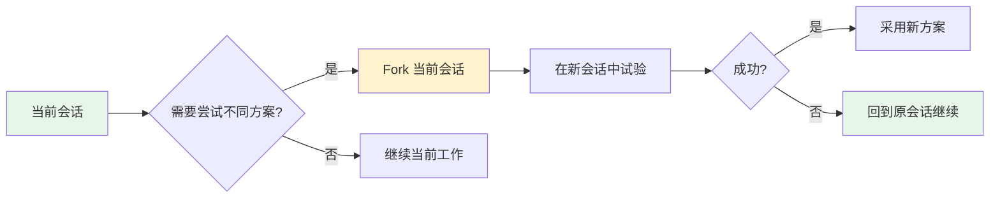

# Claude Code Fork 会话功能 (Branching Conversation)


<div class="record-meta-block">
<div class="meta-item"><span class="meta-label">收录日期</span><span class="meta-value">2026-01-30</span></div>
<div class="meta-item meta-item--tags"><span class="meta-label">标签</span><span class="meta-value"><a href="/records/?tags=ai" class="meta-tag">AI</a> <a href="/records/?tags=tools" class="meta-tag">工具</a> <a href="/records/?tags=reference" class="meta-tag">参考</a> <a href="/records/?tags=claude-code" class="meta-tag">Claude Code</a></span></div>
<div class="meta-item"><span class="meta-label">状态</span><span class="meta-value meta-value--status meta-value--success"> 已验证</span></div>
<div class="meta-item"><span class="meta-label">可信度</span><span class="meta-value"><span class="star-rating"></span> <span class="star-desc">官方文档</span></span></div>
</div>


**问题/场景**：

在复杂任务中想尝试不同的方案，但不希望丢失当前会话的进度，或者需要并行探索多种实现路径。

**解决方案/结论**：

使用 `--fork-session` CLI 标志复制当前会话，创建一个独立的分支会话。

#### 使用方式

```bash
# 基本用法：复制当前会话
claude --fork-session

# 结合恢复使用：恢复某个会话并立即 fork
claude --resume <session-id> --fork-session

# 从特定会话 fork
claude --continue <session-id> --fork-session
```

#### 适用场景

| 场景 | 说明 |
|------|------|
| 尝试不同方案 | 想从某个点尝试不同的实现方法，失败了可以回退 |
| 并行探索 | 同时探索多个技术方案，各自独立进行 |
| 实验性尝试 | 不确定方案是否可行，创建分支会话测试 |

#### 工作流程



#### 关键特点

- **独立会话 ID**：Fork 的会话有独立的 UUID
- **完全隔离**：两个会话互不影响
- **随时切换**：可以通过 `/resume` 在不同会话间切换
- **双 Esc 快捷键**：`Esc+Esc` 打开会话选择器，包括 fork 的会话

**参考链接**：

- [GitHub Issue: Clone/duplicate conversation](https://github.com/anthropics/claude-code/issues/12941)
- [Changelog: Improved fork session hint](https://code.claude.com/docs/en/changelog)

**验证记录**：

- [2026-01-30] 来源：官方文档与 Release Note
