# KiraFramework Unity 游戏开发框架分析


<div class="record-meta-block">
<div class="meta-item meta-item--tags"><span class="meta-label">标签</span><span class="meta-value"><a href="/records/?tags=unity" class="meta-tag">Unity 引擎</a> <a href="/records/?tags=csharp" class="meta-tag">C#</a> <a href="/records/?tags=architecture" class="meta-tag">架构设计</a> <a href="/records/?tags=ui" class="meta-tag">UI</a> <a href="/records/?tags=mvvm" class="meta-tag">MVVM 架构</a> <a href="/records/?tags=knowledge" class="meta-tag">知识</a></span></div>
<div class="meta-item"><span class="meta-label">来源</span><span class="meta-value">[项目代码分析 - 实践总结]</span></div>
<div class="meta-item"><span class="meta-label">收录日期</span><span class="meta-value">2026-02-16</span></div>
<div class="meta-item"><span class="meta-label">来源日期</span><span class="meta-value">2026-02-16</span></div>
<div class="meta-item"><span class="meta-label">更新日期</span><span class="meta-value">2026-02-16</span></div>
<div class="meta-item"><span class="meta-label">状态</span><span class="meta-value meta-value--status meta-value--info"> 有效</span></div>
<div class="meta-item"><span class="meta-label">可信度</span><span class="meta-value"><span class="star-rating"></span> <span class="star-desc">实地代码分析</span></span></div>
<div class="meta-item"><span class="meta-label">适用版本</span><span class="meta-value">Unity 2022.3.62f2c1+</span></div>
</div>


### 概要

KiraFramework 是一个以 UI 管理为核心的 Unity 游戏开发框架，采用配置驱动的代码生成系统，提供类型安全的事件通信和层级化 UI 管理。适合中小型 RPG/卡牌/策略类游戏，但 MVVM View 层尚未完成。

> **比喻**：KiraFramework 就像是一个"毛坯房"——框架结构已经搭建好，水电管道（事件系统、UI管理）已经铺设完毕，但还需要你自己装修（游戏逻辑）才能入住。

### 内容

#### 一、框架定位

KiraFramework 是一个 **"UI + 事件通信 + 代码生成"** 的轻量级框架，核心功能占比：

| 模块 | 占比 | 说明 |
|------|------|------|
| UI管理系统 | 35% | 层级管理、生命周期、实例池 |
| 事件系统 | 25% | 模块间解耦通信 |
| 代码生成 | 20% | 配置驱动自动生成 |
| MVVM架构 | 15% | 数据绑定（部分完成） |
| 其他工具 | 5% | NuGet包集成 |

#### 二、架构设计

**三层架构**：配置层(Configs) → 生成层(Generated) → 运行层(Core)

```mermaid
flowchart TB
    subgraph config["配置层 Configs"]
        direction TB
        CA1["Enum定义"]
        CA2["Static映射"]
        CA3["ViewModel配置"]
    end

    subgraph generated["生成层 Generated"]
        direction TB
        GB1["枚举类生成"]
        GB2["静态类生成"]
        GB3["UI类生成"]
    end

    subgraph core["运行层 Core"]
        direction TB
        RC1["事件系统 EventManager"]
        RC2["UI管理 UIManager"]
        RC3["MVVM绑定 ViewModelBase"]
    end

    config -->|触发生成| generated
    generated -->|提供类型| core
```



**设计模式**：单例、观察者、MVVM、工厂模式

#### 三、核心模块

##### 1. 事件系统 (EventManager)

类型安全的观察者模式实现：
- 泛型 + `IKiraEventKey` 接口约束
- 支持有参/无参事件
- `KiraObject` 基类封装简化调用

**工作流程**：

```mermaid
flowchart LR
    subgraph publisher["事件发布者"]
        P1["FireEvent T"]
    end

    subgraph manager["EventManager 单例"]
        M1["无参事件字典"]
        M2["带参事件字典"]
        M3["回调列表执行"]
    end

    subgraph subscriber["事件订阅者"]
        S1["RegisterEvent T"]
        S2["UnregisterEvent T"]
        S3["回调函数执行"]
    end

    P1 --> M1
    P1 --> M2
    S1 --> M1
    S1 --> M2
    M1 --> M3
    M2 --> M3
    M3 --> S3
```



##### 2. UI管理系统 (UIManager)

层级化 UI 管理：
- 自动 Canvas 创建与层级管理
- 实例池复用机制
- 完整生命周期：OnShow/OnHide/OnClose

**UI层级**：
| 层级 | SortingOrder | 用途 |
|------|-------------|------|
| FullScreen | 100 | 主界面、背包、设置 |
| PopWindow | 200 | 对话框、确认框 |
| TopTip | 300 | Toast、加载提示 |

**生命周期状态机**：

```mermaid
stateDiagram-v2
    [*] --> Created: Instantiate实例化
    Created --> Hidden: 初始化完成
    Hidden --> Showing: Show被调用
    Showing --> Visible: OnShow执行完成
    Visible --> Hiding: Hide被调用
    Hiding --> Hidden: OnHide执行完成
    Hidden --> Closed: Close被调用
    Closed --> [*]: Destroy销毁
```



##### 3. MVVM架构

当前完成度约 60%：
-  ViewModelBase（属性变更通知）
-  Model 属性标记
-  View 层绑定系统
-  运行时绑定组件

##### 4. 代码生成系统

配置驱动的类型安全代码生成：
- 枚举生成器：`EnumDefinitionAsset` → C# enum
- 静态类生成器：`MappingConfigSO` → 嵌套静态类
- UI组件提取：Prefab → `[SerializeField]` 引用

#### 四、框架能力详解

##### 生动的例子：玩家升级场景

```mermaid
sequenceDiagram
    participant player as 玩家
    participant logic as GameLogic
    participant event as EventManager
    participant ui as UI面板
    participant audio as 音效系统
    participant save as 存档系统

    player->>logic: 击杀怪物获得经验
    logic->>logic: 经验值达到阈值
    logic->>event: FireEvent PlayerLevelUp
    event->>ui: 通知升级事件
    event->>audio: 通知升级事件
    event->>save: 通知升级事件
    ui->>ui: 显示升级特效
    audio->>audio: 播放升级音效
    save->>save: 保存玩家等级
```



**使用 KiraFramework 的代码：**

```csharp
// 游戏逻辑 - 触发升级事件
public class PlayerLevel : KiraObject
{
    public void AddExp(int amount)
    {
        currentExp += amount;
        if (currentExp >= maxExp)
        {
            LevelUp();
        }
    }

    private void LevelUp()
    {
        currentLevel++;
        currentExp = 0;
        // 一行代码，通知所有关心升级的系统
        FireEvent<KiraEventKey.Player.LevelUp>();
    }
}

// UI面板 - 响应升级事件
public class PlayerInfoPanel : UIBase
{
    protected override void OnShow()
    {
        RegisterEvent<KiraEventKey.Player.LevelUp>(OnLevelUp);
    }

    private void OnLevelUp()
    {
        // 自动更新UI，无需知道是谁触发的升级
        levelText.text = $"Lv.{playerLevel}";
        PlayLevelUpAnimation();
    }
}

// 音效系统 - 同样响应升级事件
public class AudioManager : KiraObject
{
    void Start()
    {
        RegisterEvent<KiraEventKey.Player.LevelUp>(OnLevelUp);
    }

    private void OnLevelUp()
    {
        PlaySound("level_up");
    }
}
```

**没有框架的话，你可能需要这样写：**

```csharp
// 各种引用，高度耦合
public class PlayerLevel : MonoBehaviour
{
    public PlayerInfoPanel uiPanel;      // 需要引用UI
    public AudioManager audioManager;    // 需要引用音效
    public SaveManager saveManager;      // 需要引用存档

    private void LevelUp()
    {
        currentLevel++;
        uiPanel.UpdateLevel(currentLevel);      // 手动调用
        audioManager.PlayLevelUpSound();        // 手动调用
        saveManager.SavePlayerLevel(currentLevel); // 手动调用
        // 每增加一个功能，都要改这里...
    }
}
```

** 框架能做的：**

| 能力 | 描述 | 你可以这样做 |
|------|------|-------------|
| **事件通信** | 模块间解耦通信 | 玩家升级时，UI、音效、存档系统同时响应，无需相互引用 |
| **UI层级管理** | 自动管理UI叠放顺序 | 弹窗永远不会被主界面遮挡，Toast提示永远在最上层 |
| **UI生命周期** | 标准化的显示/隐藏流程 | 面板打开时初始化数据，关闭时清理资源 |
| **代码生成** | 配置驱动的类型安全 | 修改配置后一键生成代码，再也不怕字符串拼写错误 |
| **MVVM数据绑定** | 数据与UI分离 | 玩家血量变化时，UI自动更新，无需手动刷新 |

** 框架不能做的：**

| 局限 | 说明 | 影响程度 |
|------|------|---------|
| MVVM View层缺失 | 有ViewModel但没View绑定，需要手动写绑定代码 |  严重 |
| 没有资源热更新 | 使用Resources.Load，无法运行时下载资源 |  中等 |
| 没有网络模块 | 需要自己实现HTTP/WebSocket通信 |  中等 |
| 没有存档系统 | 只有数据绑定，没有实际的序列化/存储实现 |  中等 |
| 没有对象池 | 需要自己实现通用的对象池管理 |  轻微 |
| 没有测试框架 | 没有单元测试基础设施 |  轻微 |

#### 五、实际应用场景示例

##### 场景一：背包系统

```mermaid
flowchart TB
    subgraph userflow["用户操作流程"]
        A["点击背包按钮"]
        B["背包面板弹出"]
        C["显示物品列表"]
        D["点击物品"]
        E["显示物品详情"]
        F["使用装备物品"]
    end

    A --> B --> C --> D --> E --> F

    subgraph framework["框架能帮忙的"]
        H1["UIManager.Show BagPanel"]
        H2["事件通知物品变化"]
        H3["层级管理弹窗在最上层"]
    end

    subgraph custom["需要自己写的"]
        S1["物品数据结构"]
        S2["物品列表滚动视图"]
        S3["拖拽交换逻辑"]
        S4["使用物品的业务逻辑"]
    end
```



**框架帮你做的：**
```csharp
// 打开背包
UIManager.Show&lt;BagPanel&gt;();

// 通知物品变化
FireEvent<KiraEventKey.Bag.ItemChanged>(new ItemChangedArgs { ItemId = 1001 });
```

**你需要自己写的：**
```csharp
// 物品数据模型
public class ItemData
{
    public int Id;
    public string Name;
    public int Count;
    public ItemType Type;
}

// 物品使用逻辑
public void UseItem(int itemId)
{
    var item = bagData.GetItem(itemId);
    switch (item.Type)
    {
        case ItemType.Potion:
            player.HP += item.Value;
            break;
        case ItemType.Equipment:
            player.Equip(item);
            break;
    }
}
```

##### 场景二：对话系统

```mermaid
flowchart TB
    subgraph dialogflow["NPC对话流程"]
        A["玩家接近NPC"]
        B["按交互键"]
        C["对话面板弹出"]
        D["显示对话文本"]
        E["打字机效果"]
        F["点击继续"]
        G["下一段对话结束"]
    end

    A --> B --> C --> D --> E --> F --> G

    subgraph fwsupport["框架支持"]
        F1["UIManager管理对话面板"]
        F2["事件系统通知对话状态"]
        F3["层级管理确保对话在最上层"]
    end

    subgraph customdev["自行开发"]
        S1["对话数据解析"]
        S2["对话树逻辑"]
        S3["打字机动画效果"]
        S4["选项分支逻辑"]
    end
```



##### 场景三：游戏设置界面（框架特别适合）

```csharp
// 设置界面 ViewModel
public class SettingsViewModel : ViewModelBase
{
    private float _masterVolume = 1f;
    public float MasterVolume
    {
        get => _masterVolume;
        set => SetProperty(ref _masterVolume, value);
    }

    private int _qualityLevel = 2;
    public int QualityLevel
    {
        get => _qualityLevel;
        set => SetProperty(ref _qualityLevel, value);
    }
}

// 配合 NuGet 包的 Newtonsoft.Json 轻松保存
public void SaveSettings()
{
    var json = JsonConvert.SerializeObject(settingsViewModel);
    File.WriteAllText(savePath, json);
}
```

#### 六、适用场景总结

```mermaid
flowchart LR
    subgraph suitable["适合使用 KiraFramework"]
        A1["中小型 RPG卡牌游戏"]
        A2["休闲益智类游戏"]
        A3["需要复杂UI的游戏"]
        A4["独立游戏开发"]
    end

    subgraph unsuitable["不太适合"]
        B1["大型3D动作游戏"]
        B2["多人实时竞技游戏"]
        B3["超休闲游戏"]
    end

    subgraph extend["需要大量扩展"]
        C1["MMO类型游戏"]
        C2["需要热更新的游戏"]
        C3["跨平台手游"]
    end
```



- **适合**：中小型 RPG/卡牌游戏、休闲益智类、需要复杂UI的游戏、独立游戏开发
- **不太适合**：大型3D动作游戏（需要更多物理/动画支持）、多人实时竞技游戏（需要专业网络框架）、超休闲游戏（框架可能过重）
- **需要扩展**：MMO类型游戏、需要热更新的游戏、跨平台手游

#### 七、主要问题

| 优先级 | 问题 | 严重程度 | 建议措施 |
|--------|------|---------|---------|
|  高 | MVVM View层未实现 | 严重 | 实现ViewBase和绑定系统 |
|  高 | 运行时绑定系统缺失 | 严重 | 开发Binding组件 |
|  中 | 使用 Resources.Load 而非 Addressables | 中等 | 迁移到Addressables |
|  中 | 缺少单元测试框架 | 中等 | 集成Unity Test Framework |
|  中 | 缺少DI容器 | 中等 | 考虑引入VContainer |
|  低 | 异步支持不足 | 轻微 | 添加async/await支持 |
|  低 | 文档不完善 | 轻微 | 补充API文档 |

#### 八、综合评分

**总分：78/100**

| 维度 | 评分 | 说明 |
|------|------|------|
| 架构设计 | 90/100 | 分层清晰，设计模式运用得当，职责分离明确 |
| 代码质量 | 80/100 | 代码整洁，命名规范，有基础注释 |
| 扩展性 | 85/100 | 基类设计合理，事件解耦，易于添加新功能 |
| 文档 | 60/100 | 基础注释存在，缺少系统性文档和使用指南 |
| 测试 | 30/100 | 缺少测试框架和测试用例 |
| 性能 | 75/100 | 基础优化到位，实例池复用，有进一步提升空间 |

### 关键代码

```csharp
// 核心文件路径
Core/Base/KiraObject.cs        // 事件集成基类
Core/Base/UIBase.cs            // UI面板基类
Core/Manager/EventManager.cs   // 事件管理单例
Core/Manager/UIManager.cs      // UI管理器
MVVM/VM/ViewModelBase.cs       // ViewModel基类
Configs/Enum/                  // 枚举定义配置
Configs/KiraStatics/           // 静态映射配置
Scripts/Generated/             // 自动生成代码目录
```

### 依赖库

| 包名 | 用途 | 重要性 |
|------|------|--------|
| Newtonsoft.Json | JSON序列化/反序列化 | ⭐⭐⭐⭐⭐ |
| BouncyCastle.Cryptography | 加密算法库 (RSA, AES等) | ⭐⭐⭐⭐ |
| SixLabors.ImageSharp | 图像处理 | ⭐⭐⭐⭐ |
| ZString | 高性能字符串构建 | ⭐⭐⭐⭐ |
| MathNet.Numerics | 高级数学运算 | ⭐⭐⭐ |
| NPOI | Office文档读写 | ⭐⭐⭐ |
| SharpZipLib | 压缩/解压 | ⭐⭐⭐ |

### 相关记录

- [unity-framework-architecture.md](./unity-framework-architecture) - Unity 中的 C# 脚本编程相关经验
- [unity-editor-api.md](./unity-editor-api) - Unity Editor 开发知识
- [effect-system-code-review.md](./effect-system-code-review) - EffectSystem 效果系统 - 代码审查与架构分析

### 验证记录

- [2026-02-16] 初次记录，来源：KiraFramework 项目代码深度分析
- [2026-02-16] 补充完整内容：添加生动例子、场景示例、Mermaid流程图
- [2026-02-16] 修复 Mermaid 语法：将中文 ID 改为英文，中文作为显示标签
