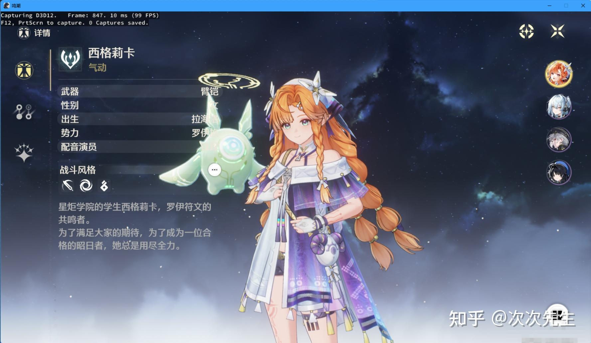

# 魔改RenderDoc截帧PC端《鸣潮》


<div class="record-meta-block">
<div class="meta-item meta-item--tags"><span class="meta-label">标签</span><span class="meta-value"><a href="/records/?tags=graphics" class="meta-tag">图形学</a> <a href="/records/?tags=windows" class="meta-tag">Windows</a> <a href="/records/?tags=reference" class="meta-tag">参考</a> <a href="/records/?tags=renderdoc" class="meta-tag">RenderDoc</a> <a href="/records/?tags=anti-bot" class="meta-tag">反爬虫</a> <a href="/records/?tags=hook" class="meta-tag">Hook</a> <a href="/records/?tags=rendering" class="meta-tag">渲染</a> <a href="/records/?tags=zhihu" class="meta-tag">知乎</a></span></div>
<div class="meta-item"><span class="meta-label">来源</span><span class="meta-value"><a href="https://zhuanlan.zhihu.com/p/2020093825977168718" target="_blank" rel="noopener">知乎专栏 - 魔改RenderDoc截帧PC端《鸣潮》</a></span></div>
<div class="meta-item"><span class="meta-label">收录日期</span><span class="meta-value">2026-04-04</span></div>
<div class="meta-item"><span class="meta-label">来源日期</span><span class="meta-value">编辑于 2026-03-25（重庆）</span></div>
<div class="meta-item"><span class="meta-label">状态</span><span class="meta-value meta-value--status meta-value--warning"> 待验证</span></div>
<div class="meta-item"><span class="meta-label">可信度</span><span class="meta-value"><span class="star-rating"></span> <span class="star-desc">社区经验，有详细代码路径但未实测</span></span></div>
<div class="meta-item"><span class="meta-label">适用版本</span><span class="meta-value">RenderDoc v1.x | Windows | PC 端鸣潮</span></div>
</div>


### 概要
通过修改 RenderDoc 源码中的所有特征字符串（`renderdoc` → `rendertest`），绕过《鸣潮》对 RenderDoc 的检测（包括文件特征码扫描和 CrashSight 检测），实现在 PC 端使用 RenderDoc 进行截帧和 Shader 分析。

### 内容



前言

之前写过一些截帧的文章，主要是通过模拟器来绕过加密系统，但是现在想想有可能两个游戏在移动端和PC端上用的Shader不一样，现在想用RenderDoc来截取PC环境下两个游戏的Shader


## 《鸣潮》是如何检测到RenderDoc的？

如果你是直接下载的打包好的RenderDoc，那么无论你是否从RenderDoc启动游戏还是是否有任何注入，都会显示启用了黑客工具


此外，《鸣潮》采用了CrashSight检测，所以在做的时候不但要修改RenderDoc的特征码，还需要修改注入方式

## 前期准备

RenderDoc的工具集是VS2015的v140版本，我用的是VS2022所以需要额外下载v140组件，或者是可以到源码里面手动更新平台工具集

## 一，修改RenderDoc的特征来绕过第一步检测
### 核心 DLL — Replay Marker 符号

| 文件路径 | 行号 | 修改类型 | 修改前 | 修改后 |
|----------|------|----------|--------|--------|
| renderdoc/api/replay/renderdoc_replay.h | 52 | 函数名修改 | renderdoc__replay__marker() | rendertest__replay__marker() |

> 说明：这是最核心的修改。REPLAY_PROGRAM_MARKER() 宏定义所有 RenderDoc 可执行文件导出的符号，DLL 通过动态查找该符号判断当前是 replay 环境还是目标游戏进程。若 DLL 期望 rendertest__replay__marker 但 EXE 导出的是 renderdoc__replay__marker，DLL 将误判为游戏进程并注入 GPU 钩子，导致 UI 崩溃。

### 进程创建与注入 — 可执行文件路径硬编码

| 文件路径 | 行号 | 修改类型 | 修改前 | 修改后 |
|----------|------|----------|--------|--------|
| renderdoc/os/win32/win32_process.cpp | 933 | 字符串替换 | L"\\Win32\\Development\\renderdoccmd.exe" | L"\\Win32\\Development\\rendertestcmd.exe" |
| renderdoc/os/win32/win32_process.cpp | 946 | 字符串替换 | L"\\Win32\\Release\\renderdoccmd.exe" | L"\\Win32\\Release\\rendertestcmd.exe" |
| renderdoc/os/win32/win32_process.cpp | 961 | 字符串替换 | L"\\x86\\renderdoccmd.exe" | L"\\x86\\rendertestcmd.exe" |
| renderdoc/os/win32/win32_process.cpp | 973 | 字符串替换 | L"\\x64\\Development\\renderdoccmd.exe" | L"\\x64\\Development\\rendertestcmd.exe" |
| renderdoc/os/win32/win32_process.cpp | 986 | 字符串替换 | L"\\x64\\Release\\renderdoccmd.exe" | L"\\x64\\Release\\rendertestcmd.exe" |
| renderdoc/os/win32/win32_process.cpp | 1006 | 字符串替换 | L"\\renderdoccmd.exe" | L"\\rendertestcmd.exe" |

### Shim DLL 路径硬编码

| 文件路径 | 行号 | 修改类型 | 修改前 | 修改后 |
|----------|------|----------|--------|--------|
| renderdoc/os/win32/win32_process.cpp | 1783 | 字符串拼接 | "\\renderdocshim64.dll" | "\\rendertestshim64.dll" |
| renderdoc/os/win32/win32_process.cpp | 1792 | 字符串拼接 | "\\Win32\\Development\\renderdocshim32.dll" | "\\Win32\\Development\\rendertestshim32.dll" |
| renderdoc/os/win32/win32_process.cpp | 1803 | 字符串拼接 | "\\Win32\\Release\\renderdocshim32.dll" | "\\Win32\\Release\\rendertestshim32.dll" |
| renderdoc/os/win32/win32_process.cpp | 1811 | 字符串拼接 | "\\x86\\renderdocshim32.dll" | "\\x86\\rendertestshim32.dll" |
| renderdoc/os/win32/win32_process.cpp | 1818 | 字符串拼接 | "\\renderdocshim32.dll" |  |

### 进程白名单 — 避免注入到 RenderTest 自身

| 文件路径 | 行号 | 修改类型 | 修改前 | 修改后 |
|----------|------|----------|--------|--------|
| renderdoc/os/win32/sys_win32_hooks.cpp | 342 | 字符串替换 | "renderdoccmd.exe" \|\| app.contains("qrenderdoc.exe") | "rendertestcmd.exe" \|\| app.contains("qrendertest.exe") |
| renderdoc/os/win32/sys_win32_hooks.cpp | 351 | 字符串替换 | "renderdoccmd.exe" \|\| cmd.contains("qrenderdoc.exe") | "rendertestcmd.exe" \|\| cmd.contains("qrendertest.exe") |

### 崩溃处理 — 命名内核对象

| 文件路径 | 行号 | 修改类型 | 修改前 | 修改后 |
|----------|------|----------|--------|--------|
| renderdoccmd/renderdoccmd_win32.cpp | 603 | 字符串替换 | "RENDERDOC_CRASHHANDLE" | "RENDERTEST_CRASHHANDLE" |
| renderdoccmd/renderdoccmd_win32.cpp | 818 | 字符串替换 | GetModuleHandleA("renderdoc.dll") | GetModuleHandleA("rendertest.dll") |
| core/crash_handler.h | 62 | 字符串拼接 | "RenderDoc\\dumps\\a" | "RenderTest\\dumps\\a" |
| core/crash_handler.h | 168 | 字符串拼接 | "RenderDocBreakpadServer%llu" | "RenderTestBreakpadServer%llu" |

### 表格 6：文件路径与注册表

| 文件路径 | 行号 | 修改类型 | 修改前 | 修改后 |
|----------|------|----------|--------|--------|
| renderdoc/os/win32/win32_stringio.cpp | 289 | 字符串拼接 | "/qrenderdoc.exe" | "/qrendertest.exe" |
| renderdoc/os/win32/win32_stringio.cpp | 300 | 字符串拼接 | "/../qrenderdoc.exe" | "/../qrendertest.exe" |
| renderdoc/os/win32/win32_stringio.cpp | 316 | 注册表路径 | L"RenderDoc.RDCCapture.1\\DefaultIcon" | L"RenderTest.RDCCapture.1\\DefaultIcon" |
| renderdoc/os/win32/win32_stringio.cpp | 358 | 日志路径 | L"RenderDoc\\%ls_..." | L"RenderTest\\%ls_..." |
| renderdoc/os/win32/win32_stringio.cpp | 367 | 日志路径 | L"RenderDoc\\%ls_..." | L"RenderTest\\%ls_..." |

### OpenGL 窗口类名

| 文件路径 | 行号 | 修改类型 | 修改前 | 修改后 |
|----------|------|----------|--------|--------|
| driver/gl/wgl_platform.cpp | 28 | 宏定义 | L"renderdocGLclass" | L"rendertestGLclass" |

### 全局 Hook 共享内存名称

| 文件路径 | 行号 | 修改类型 | 修改前 | 修改后 |
|----------|------|----------|--------|--------|
| renderdocshim/renderdocshim.h | 36 | 宏定义 | "RenderDocGlobalHookData64" | "RenderTestGlobalHookData64" |
| renderdocshim/renderdocshim.h | 39 | 宏定义 | "RenderDocGlobalHookData32" | "RenderTestGlobalHookData32" |

### 资源文件

| 文件路径 | 行号 | 修改类型 | 修改前 | 修改后 |
|----------|------|----------|--------|--------|
| data/renderdoc.rc | 87 | 资源字符串 | "Core DLL for RenderDoc" | "Core DLL for RenderTest" |
| data/renderdoc.rc | 92 | 资源字符串 | "ProductName", "RenderDoc" | "ProductName", "RenderTest" |

### Qt UI 层

| 文件路径 | 行号 | 修改类型 | 修改前 | 修改后 |
|----------|------|----------|--------|--------|
| qrenderdoc/renderdocui_stub.cpp | 62 | 字符串拼接 | L"qrenderdoc.exe" | L"qrendertest.exe" |
| qrenderdoc/Code/qrenderdoc.cpp | 173 | Qt 翻译上下文 | "qrenderdoc" | "qrendertest" |
| qrenderdoc/Code/qrenderdoc.cpp | 198 | 日志输出 | "QRenderDoc initialising." | "QRenderTest initialising." |
| qrenderdoc/Code/qrenderdoc.cpp | 267 | 会话名 | "QRenderDoc" | "QRenderTest" |
| qrenderdoc/Code/qrenderdoc.cpp | 330 | 描述文本 | "Qt UI for RenderDoc" | "Qt UI for RenderTest" |
| qrenderdoc/Code/qrenderdoc.cpp | 393 | 版本输出 | "QRenderDoc v%s" | "QRenderTest v%s" |
| qrenderdoc/Windows/MainWindow.cpp | 1217 | 窗口标题 | "RenderDoc " | "RenderTest " |

### VS 项目文件（编译输出名 + UAC 提权）

| 文件路径 | 属性 | 修改类型 | 修改前 | 修改后 |
|----------|------|----------|--------|--------|
| qrenderdoc/renderdocui_stub.vcxproj | RootNamespace | 修改 | renderdocui_stub | rendertestui_stub |
| qrenderdoc/renderdocui_stub.vcxproj | ProjectName | 修改 | renderdocui_stub | rendertestui_stub |
| qrenderdoc/renderdocui_stub.vcxproj | PrimaryOutput | 新增 | (无) | rendertestui |
| qrenderdoc/renderdocui_stub.vcxproj | TargetName | 新增 | (无) | rendertestui |
| qrenderdoc/renderdocui_stub.vcxproj | UACExecutionLevel | 新增 | (无) | RequireAdmini |

## CrashSight检测

这里可以在Hook的时候采用SetThreadContext注入

修改文件:renderdoc/os/win32/win32_process.cpp

```cpp
      uintptr_t loc = FindRemoteDLL(pi.dwProcessId, STRINGIZE(RDOC_BASE_NAME) ".dll");
      CloseHandle(hProcess);
      hProcess = NULL;
      if(loc != 0)
```

### 参考链接

- [魔改RenderDoc截帧PC端《鸣潮》](https://zhuanlan.zhihu.com/p/2020093825977168718) - 原文
- [RenderDoc v1.x 源码](https://github.com/baldurk/renderdoc/tree/v1.x) - GitHub

### 相关记录

- [endfield-rendering-study.md](./endfield-rendering-study) - 终末地角色渲染技术分析（同为游戏渲染逆向分析）

### 验证记录
- [2026-04-04] 初次记录，来源：知乎专栏文章，完整抓取含图片，未实测验证
