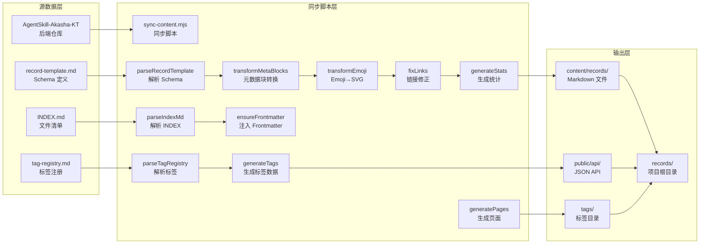
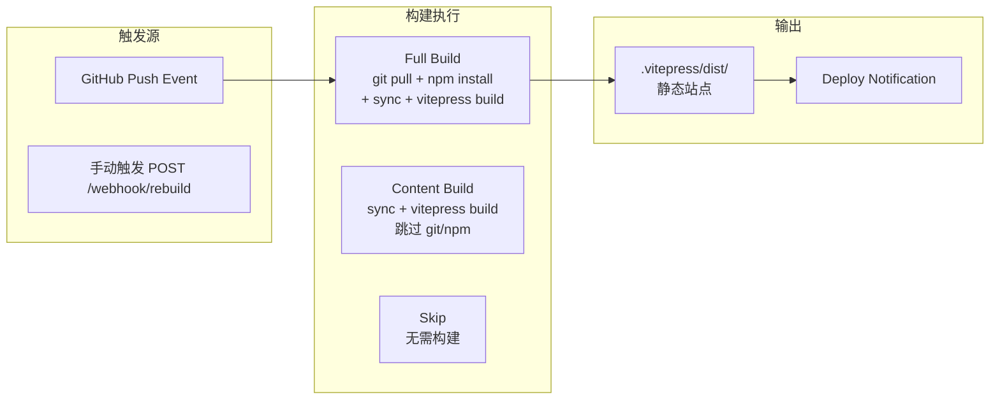
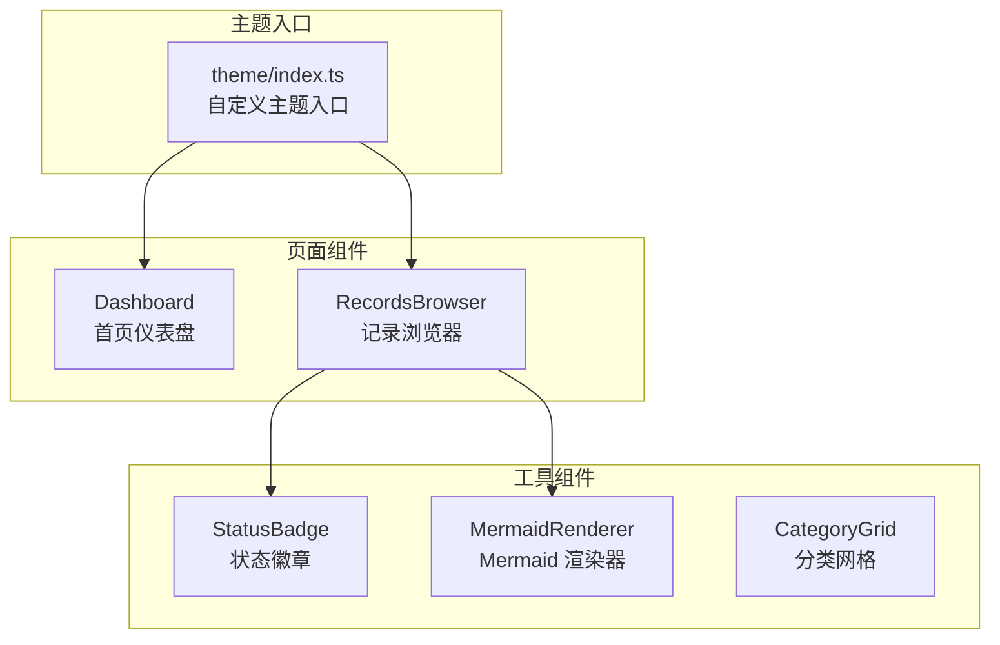
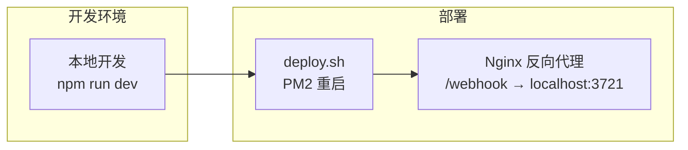

# 阿卡西记录 Web 项目架构深度解析


<div class="record-meta-block">
<div class="meta-item meta-item--tags"><span class="meta-label">标签</span><span class="meta-value"><a href="/records/?tags=web" class="meta-tag">Web 开发</a> <a href="/records/?tags=vitepress" class="meta-tag">VitePress</a> <a href="/records/?tags=architecture" class="meta-tag">架构设计</a> <a href="/records/?tags=reference" class="meta-tag">参考</a></span></div>
<div class="meta-item"><span class="meta-label">来源</span><span class="meta-value"><a href="https://github.com/KTSAMA001/AkashaRecord-Web" target="_blank" rel="noopener">AkashaRecord-Web 项目</a> - 架构分析与文档</span></div>
<div class="meta-item"><span class="meta-label">收录日期</span><span class="meta-value">2026-02-16</span></div>
<div class="meta-item"><span class="meta-label">状态</span><span class="meta-value meta-value--status meta-value--info"> 有效</span></div>
<div class="meta-item"><span class="meta-label">可信度</span><span class="meta-value"><span class="star-rating"></span></span></div>
<div class="meta-item"><span class="meta-label">适用版本</span><span class="meta-value">VitePress v2.2.0</span></div>
</div>


---

### 概要

AkashaRecord-Web 是阿卡西记录知识库的 Web 前端展示平台，采用 VitePress 构建静态站点，辅以 Express Webhook 服务实现自动构建。本文档提供了完整的技术架构、核心流程、组件系统、数据流与部署方案解析。

---

### 核心特性

- 🔄 自动内容同步 - 从阿卡西记录后端仓库拉取并转换格式
- 🏷️ 扁平化标签体系 - 多标签筛选，支持 URL 参数分享
- 🔍 本地全文搜索 - 中文支持，标题+标签联合匹配
- 📊 数据驱动渲染 - Schema-Driven，零硬编码
- 🎨 工业风 UI - 明日方舟风格，暗色/亮色主题
- 📦 智能构建策略 - Webhook 触发，区分完整/轻量构建
- 🎯 交叉引用 - 记录间通过标签和链接关联

---

### 技术栈

#### 前端框架
- Vue 3.5.0 - 响应式 UI
- VitePress 1.5.0 - 静态站点构建
- VueUse 14.2.0 - React Hooks 风格工具
- NProgress 0.2.0 - 路由切换进度

#### 内容处理
- Markdown-it 14.1.0 - 内容渲染
- markdown-it-mathjax3 4.3.2 - LaTeX 公式支持
- Mermaid 11.12.2 - 流程图渲染
- gray-matter 4.0.3 - Frontmatter 解析

#### 服务端
- Express 4.21.0 - HTTP 服务
- Node.js runtime

---

### 项目结构

```
AkashaRecord-Web/
├── .vitepress/                  # VitePress 配置与主题（核心）
│   ├── config.mts               # 站点配置
│   ├── theme/                  # 自定义主题（工业风）
│   │   ├── index.ts            # 主题入口，注册全局组件
│   │   ├── components/         # Vue 组件库
│   │   │   ├── Dashboard.vue      # 首页仪表盘
│   │   │   ├── RecordsBrowser.vue # 记录浏览器（核心组件）
│   │   │   ├── StatusBadge.vue    # 状态徽章组件
│   │   │   ├── Mermaid.vue        # Mermaid 图表容器
│   │   │   ├── MermaidRenderer.vue # Mermaid 渲染器
│   │   │   ├── CategoryGrid.vue   # 分类网格
│   │   │   └── ThemePicker.vue   # 主题切换器
│   │   └── styles/           # 自定义样式
│   │       ├── custom.css       # 工业风主题样式
│   │       └── nprogress.css    # 路由进度条样式
│   ├── utils/                   # 工具函数
│   │   └── sidebar.ts        # 侧边栏/导航生成
│   └── dist/                   # 构建输出（gitignored）
├── scripts/                      # 构建脚本
│   └── sync-content.mjs        # 内容同步脚本（核心）
├── server/                       # Webhook 服务
│   └── webhook.mjs            # GitHub Webhook 接收服务
├── deploy/                       # 部署配置
│   ├── deploy.sh              # 一键部署脚本
│   └── nginx.conf            # Nginx 配置模板
├── public/                      # 静态资源（构建后直接复制）
│   ├── api/                   # 生成的 API 数据
│   │   ├── stats.json         # 站点统计
│   │   ├── tags.json          # 标签数据
│   │   ├── tag-meta.json      # 标签元数据
│   │   └── meta-schema.json   # Schema 定义
│   ├── icons/                 # SVG 图标库（28个图标）
│   ├── logo.svg               # 品牌标识
│   └── favicon.svg            # 网站图标
├── records/                      # 同步的记录（gitignored）
├── tags/                        # 标签索引页（gitignored）
├── .akasha-repo/                # 阿卡西数据仓库克隆（gitignored）
├── index.md                     # 首页
├── package.json                 # 项目配置
└── README.md                    # 项目说明
```

---

### 核心流程

#### 内容同步流水线



#### Webhook 构建流程



---

### 组件架构



---

### 主题系统

#### 工业风设计语言

| 设计元素 | 实现方式 | CSS 变量 |
|----------|----------|----------|
| **切角** | `clip-path: polygon()` | - |
| **左侧高亮条** | `::before` 伪元素 + `scaleY` | `--ak-accent` |
| **微光扫过** | `linear-gradient` + `transform` | `--ak-accent` |
| **噪点纹理** | `background-image: url()` + `filter` | `--ak-noise-opacity` |
| **网格背景** | `background-image: url()` | `--ak-grid-color` |

#### 动效规范

| 交互类型 | 位移值 | 过渡曲线 | 过渡时长 |
|----------|--------|----------|----------|
| **hover 位移** | `translateX(4px)` | `cubic-bezier(0.4, 0, 0.2, 1)` | `0.3s` |
| **高亮条动画** | `scaleY(0) → scaleY(1)` | `ease` | `0.3s` |
| **卡片入场** | `margin-top: 16px → 0` | `cubic-bezier(0.4, 0, 0.2, 1)` | `0.4s` |
| **微光扫过** | `translateX(-100%) → 100%` | `ease` | `0.6s` |

---

### 部署架构



#### Nginx 配置要点

```nginx
server {
    listen 80;
    server_name YOUR_DOMAIN;
    root /www/wwwroot/AkashaRecord-Web/.vitepress/dist;

    # 静态资源缓存（长期）
    location ~* \.(js|css|png|jpg|jpeg|gif|ico|svg|woff|woff2)$ {
        expires 365d;
        add_header Cache-Control "public, immutable";
    }

    # API 数据缓存（短期）
    location /api/ {
        expires 5m;
        add_header Cache-Control "public";
    }

    # Webhook 反向代理
    location /webhook {
        proxy_pass http://127.0.0.1:3721;
        proxy_http_version 1.1;
        proxy_connect_timeout 10s;
    }

    # Gzip 压缩
    gzip on;
    gzip_types text/plain text/css application/json application/javascript;
}
```

---

### API 数据格式

#### /api/tags.json
```json
[
  {
    "name": "unity",
    "count": 15,
    "files": [
      {
        "title": "Unity 动画脚本化笔记",
        "link": "/records/unity-animation-scripting-notes",
        "status": "： 已验证",
        "tags": ["unity", "animation", "script"]
      }
    ]
  }
]
```

#### /api/meta-schema.json
```json
{
  "fields": [
    {
      "fieldName": "状态",
      "key": "status",
      "renderType": "status-icon"
    }
  ],
  "statuses": [
    {
      "emoji": "",
      "label": "已验证",
      "color": "success",
      "svg": "check-circle"
    }
  ],
  "emojiMap": [
    {
      "emoji": "🔧",
      "svg": "wrench",
      "cssClass": "tech",
      "desc": "工具/配置"
    }
  ]
}
```

---

### 关键实现细节

#### 元数据块识别算法

**规则：** 连续 2+ 行 `**KEY**：VALUE` 且 `KEY` ∈ Schema.metaKeys

#### 标签筛选算法

```javascript
// 多标签交集筛选
const filteredRecords = computed(() => {
  const sel = selectedTags.value

  if (sel.size === 0) {
    return allRecords.value
  }

  // 交集：记录必须同时属于所有选中标签
  const tagArrays = [...sel]
    .map(name => tags.value.find(t => t.name === name))
    .filter(Boolean)

  // 以最小的标签文件列表为基准（优化性能）
  tagArrays.sort((a, b) => a.files.length - b.files.length)
  const baseFiles = tagArrays[0].files
  const otherSets = tagArrays.slice(1).map(t => new Set(t.files.map(f => f.link)))

  return baseFiles.filter(f => otherSets.every(s => s.has(f.link)))
})
```

---

### 架构优势

| 维度 | 评价 |
|------|------|
| **Schema-Driven** | ⭐⭐⭐⭐⭐ | 零硬编码，新增字段只需修改模板 |
| **扁平化标签** | ⭐⭐⭐⭐ | 多选筛选，URL 分享 |
| **智能构建** | ⭐⭐⭐ | Webhook 触发，按需构建 |
| **组件化** | ⭐⭐⭐⭐ | 高内聚低耦合 |
| **数据驱动** | ⭐⭐⭐⭐ | API 数据与渲染完全解耦 |
| **工业风设计** | ⭐⭐⭐⭐ | 视觉统一，品牌识别度高 |

---

### 可扩展点

| 扩展点 | 实现方式 | 优先级 |
|---------|----------|--------|
| **新增字段类型** | 修改 record-template.md，更新 sync-content.mjs | 中 |
| **新增渲染组件** | 在 theme/components/ 创建新组件 | 中 |
| **新增全局插件** | 在 theme/index.ts 注册 | 低 |
| **添加国际化** | 提取文本到 i18n 文件 | 低 |
| **添加 PWA** | 生成 Service Worker | 中 |

---

### 参考链接

- [VitePress 官方文档](https://vitepress.dev/)
- [Vue 3 文档](https://vuejs.org/)
- [VueUse 文档](https://vueuse.org/)

---

### 验证记录

- 2026-02-16 初次记录，来源：[架构分析文档]
